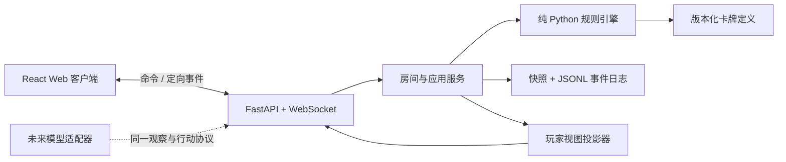

# 技术架构

## 1. 总体结构



规则引擎不依赖 FastAPI、WebSocket、数据库、浏览器或模型 SDK。

## 2. 建议仓库结构

```text
.
├── apps/
│   ├── server/                 # FastAPI 入口、房间、连接管理
│   └── web/                    # React + TypeScript
├── packages/
│   └── game_engine/
│       ├── commands.py
│       ├── events.py
│       ├── models.py
│       ├── reducer.py
│       ├── rules.py
│       ├── views.py
│       ├── abilities/
│       └── data/cards.json
├── assets/
│   ├── temporary/              # PDF 提取的开发期资源，不发布
│   ├── production/
│   └── manifest.json
├── tests/
│   ├── unit/
│   ├── scenarios/
│   ├── protocol/
│   └── e2e/
└── docs/
```

## 3. 引擎模型

### 3.1 GameState

建议至少包含：

- `game_id`、`ruleset_version`、`seed`
- `phase`：`lobby | setup | turn | resolving | scoring | finished`
- `players`：固定座位顺序、连接状态、是否退场
- `cards`：实例 ID 到卡牌定义 ID
- 各区域中的实例 ID 及顺序
- `active_player_id`
- `pending_decision`
- 延迟触发器
- 单调递增 `revision`
- 终局结果

### 3.2 Command

命令表达玩家意图，例如：

- `StartGame`
- `PlaySpecial(card_instance_id)`
- `PlayToEmbalming(card_instance_id)`
- `PlaySuspicion(card_instance_id, target_player_id)`
- `SubmitDecision(decision_id, selection)`

命令必须携带 `expected_revision`，避免双击或旧页面覆盖新状态。

### 3.3 Event

已接受命令转化为不可变事件，例如：

- `GameStarted`
- `CardMoved`
- `TurnAdvanced`
- `DecisionRequested`
- `DecisionResolved`
- `PlayerFinished`
- `PrivateCardsRevealed`
- `EmbalmingScored`
- `PlayersImprisoned`
- `GameFinished`

Reducer 只做 `state + event -> new_state`。随机选择结果必须已经写入事件，Reducer 内不得再次抽随机数。

## 4. 能力执行

首版使用显式 Python handler 注册表，不建立通用脚本语言：

```text
ability key -> validate -> create pending decision(s) -> emit events
```

理由：

- 只有 13 种角色，DSL 成本高于收益。
- 私密、多玩家同时选择和延迟触发需要明确控制流。
- 显式 handler 更易测试和审计隐藏信息。

卡牌 MP、数量、优先级和能力键由 JSON 驱动；能力规则本身由 Python 实现。

## 5. 玩家视图投影

禁止把完整 `GameState` 序列化后交给客户端再隐藏字段。必须从服务端按观看者生成 `PlayerView`：

- 自己手牌包含实例 ID、角色、MP、可用行动。
- 他人手牌只包含数量。
- 暗置区域只包含不透明实例引用或数量。
- 私密查看结果作为仅目标连接可见的定向事件，并在重连快照中按授权恢复。
- 日志分为服务端权威日志与玩家可见日志，后者同样经过投影。

## 6. 持久化与恢复

首版不需要数据库：

- 每局一个元数据 JSON。
- 每局一个追加式 JSONL 事件文件。
- 定期保存状态快照，启动时从最后快照继续重放。
- 文件写入采用临时文件加原子替换；事件追加后再向客户端确认。

若后续需要公网多实例，再将事件存储替换为 SQLite/PostgreSQL；引擎接口不变。

## 7. 未来模型边界

未来适配器只能获得某一席位的 `PlayerView`，并提交普通 `Command`。引擎额外提供：

- `legal_actions(player_id)`：所有合法动作的结构化描述。
- `observation(player_id)`：无越权信息的稳定快照。
- `public_history()` 与 `private_history(player_id)`。

模型不得直接访问权威状态、其他玩家私密事件或随机源。
